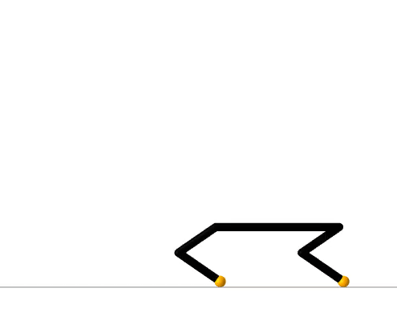
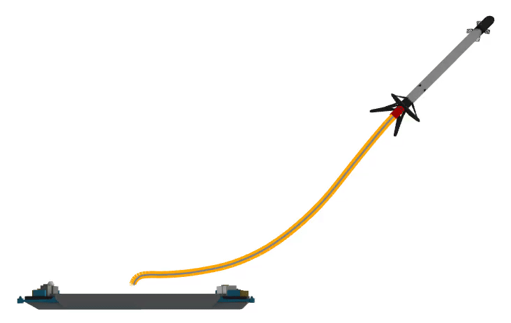
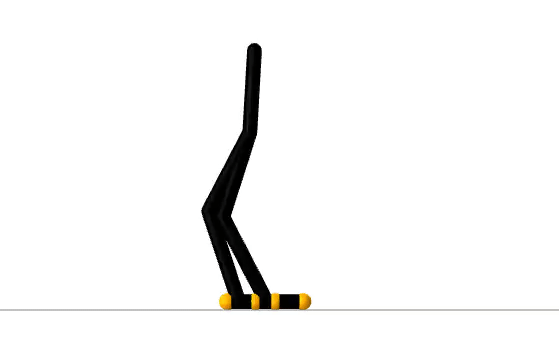
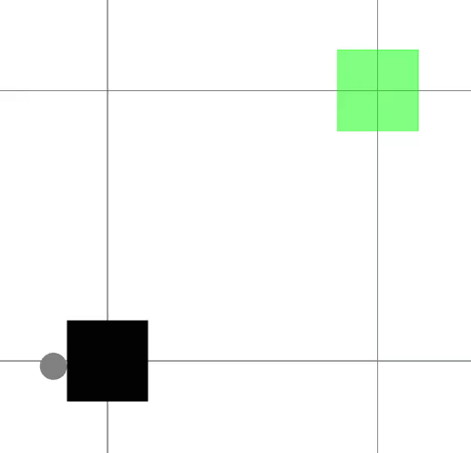
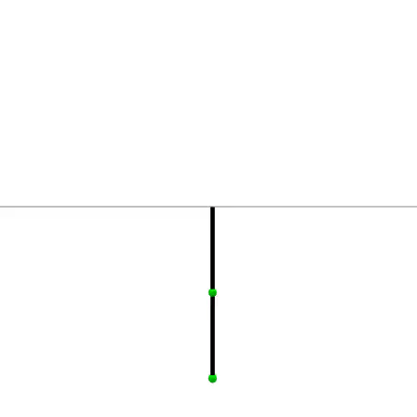
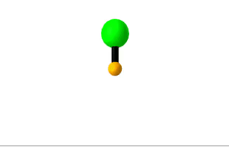
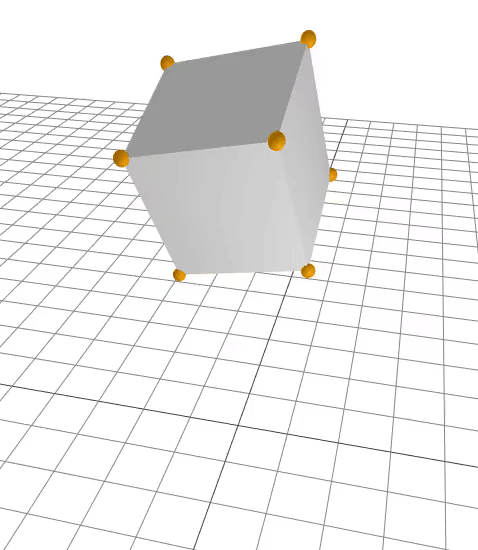

# motion_planning
Collection of algorithms, examples, and experiments for robotic motion planning.

## installation
From the Julia REPL, type `]` to enter the Pkg REPL mode and run:
```julia
pkg> add https://github.com/thowell/motion_planning
```
Additionally, once the package is activated and instantiated, set the environment and module to ```motion_planning``` in order to run scripts.

## contact-implicit trajectory optimization examples



- [X] simple manipulation
- [X] cyberdrift
- [X] cyberjump
- [X] box on corner
- [X] hopper (2D) vertical gait
- [X] hopper (2D) flip
- [ ] simple walker (2D) (add model)
- [X] hopper (3D)
- [ ] hopper (3D) wall scaling
- [ ] miniature golf (fix RBD dep.)
- [ ] ball-in-cup robot arm (move over from old script)
- [ ] ball-in-cup quadrotor (move over from old script)
- [X] biped (2D)
- [X] quadruped (2D) (modify model)
- [ ] quadruped (2D) over box
- [X] quadruped (2D) backflip
- [ ] quadruped (3D)
- [ ] ant (3D)
- [ ] snake (3D)
- [ ] atlas

## direct policy optimization examples


We provide the [examples](src/examples/direct_policy_optimization) from [Direct Policy Optimization using Deterministic Sampling and Collocation](https://arxiv.org/abs/2010.08506). Optimizing the policies requires [SNOPT](https://en.wikipedia.org/wiki/SNOPT) and resources for its installation are available [here](src/solvers/snopt.jl). The trajectories and policies from these examples have been saved and can be loaded in order to run the policy simulations and visualizations.

LQR
- [X] double integrator
- [X] planar quadrotor

motion planning
- [X] pendulum
- [X] autonomous car
- [X] cart-pole
- [X] rocket
- [X] quadrotor
- [x] biped

## linear contact-implicit model-predictive control examples


We generate reference trajectories for the examples in [Linear Contact-Implicit Model-Predictive Control](https://arxiv.org/abs/2107.05616).

- [X] [quadruped gait](examples/contact_implicit/quadruped_gait_1_step.jl)
- [X] [spring flamingo gait](examples/contact_implicit/flamingo_gait_1_step.jl)
- [X] hopper parkour: [stairs](examples/contact_implicit/hopper_stairs.jl), [flip](examples/contact_implicit/hopper_flip.jl)

## optimization-based dynamics examples


Examples from [Trajectory Optimization with Optimization-Based Dynamics](https://arxiv.org/abs/2109.04928).
- [X] acrobot
- [X] cartpole
- [X] rocket
- [X] planar push
- [X] hopper
- [ ] centroidal quadruped

## classic examples



- [X] double integrator
- [X] acrobot
- [ ] robotic arm
- [ ] quadrotor

## model-predictive control


- [X] double integrator
- [X] acrobot
- [X] hopper push recovery

## differential dynamic programming
iterative LQR is currently implemented

- [X] double integrator
- [X] pendulum
- [X] cartpole
- [X] acrobot

## simulation



we simulate objects / robots that experience contact (i.e., impact and Couloumb friction) using time-stepping techniques, discrete mechanics, nonlinear complementarity, (and collocation)

linearized friction cone
- [X] particle
- [X] box drop

second-order friction cone
- [X] particle

## TODO
- [ ] optimization-based dynamics examples
	- [ ] clean up 
	- [ ] centroidal quadruped
- [X] direct policy optimization implementation
	- [ ] update paper visualizations
	- [X] save TO and DPO trajectories
	- [ ] solve DPO to tighter tolerances
- [ ] check for SNOPT installation
- [ ] parallelize objective + constraint evaluations
- [ ] tests
- [X] visualization dependencies
	- [X] select default background
	- [X] set default views
- [X] nonlinear objective (stage wise)
- [X] constraints (stage wise)
- [X] discrete dynamics parameterization
- [X] embed animations in README
- [X] dispatch over model type for free final time
- [ ] analytical velocity objective gradient
- [ ] large-scale augmented Lagrangian solver
- [ ] contact simulator
